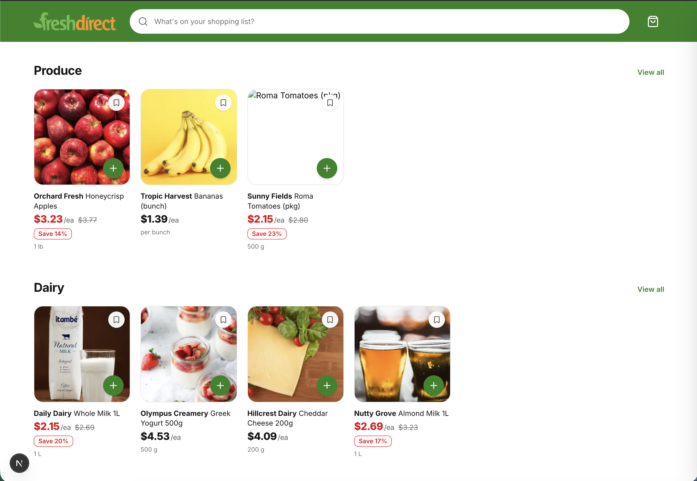
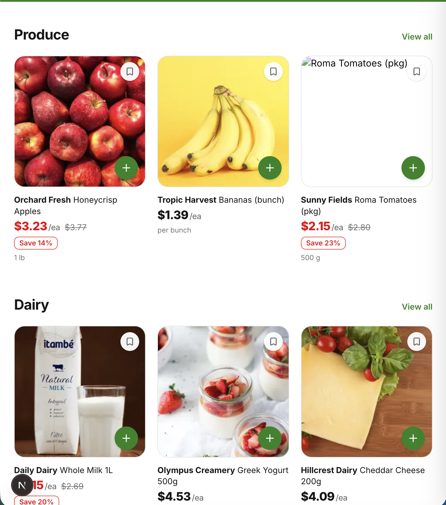
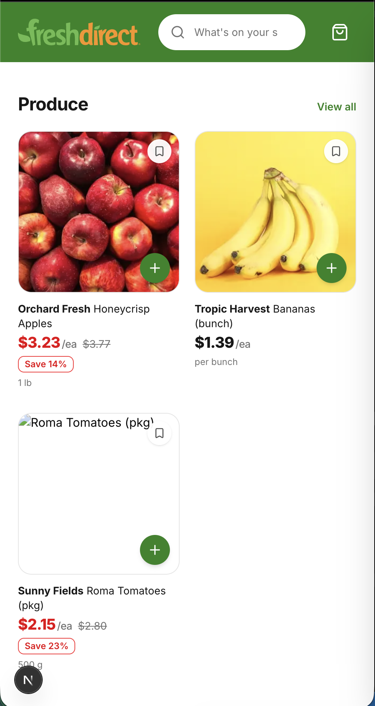
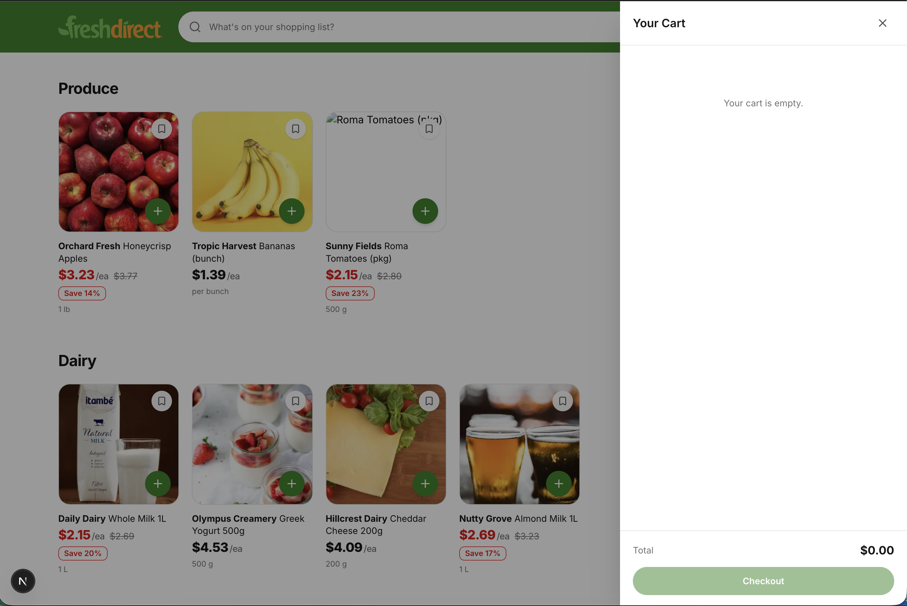

# FreshDirect - Frontend Live Coding Case

**Time limit:** 60 minutes
**Stack:** Next.js 16 (App Router) + TypeScript + Tailwind CSS v4 + shadcn/ui

---

## Goal

Build a grocery e-commerce homepage inspired by FreshDirect (https://www.freshdirect.com).

The product listing should **generally resemble** the FreshDirect website. It does **not** need to be a pixel-perfect clone — the overall look and feel is enough. We are evaluating your component structure, state management, and UI sense, not your ability to trace a design.

---

## Visual Reference

The screenshots below show roughly what the finished case should look like. Your implementation does not need to match these exactly — use them as a visual direction, not a specification.

### Desktop

### Tablet

### Mobile

### Cart drawer (open state)

_Explanation:_ Notice the responsive grid (6 columns on desktop, 3 on tablet, 2 on mobile), the card anatomy (save button top-right, green "+" button bottom-right of the image, discounted price in red with strikethrough original + "Save X%" badge), and the right-side cart drawer with an empty state and a total row.

---

## Requirements

### 1. Homepage — Product Listing

- Display products from `mocks/products.tsx` as cards in a responsive grid.
- Products can optionally be grouped by category (Produce, Dairy, Bakery, Meat, Frozen).
- The design should be clean, user-friendly, and visually similar to FreshDirect.

_Explanation:_ Your homepage is the main surface we are looking at. Think about spacing, grid breakpoints, hierarchy of information on the page, and a clear visual rhythm between cards.

### 2. Product Card

Each card should display:

- Product **image**
- **Brand**
- **Name**
- **Price**
- **Discounted price** (only some products have one — the card must handle both cases)
- **Unit** (e.g. "1 lb", "500 g", "per bunch")
- Prices in the data are stored in **euros** (`currency: "EUR"`), but on the UI they must be displayed in **US dollars ($)**. Use a fixed conversion rate of your choice (for example `1 EUR = 1.08 USD`) and apply it consistently to both the regular price and the discounted price.
- **Top-right corner:** a save / bookmark button (icon button)
- **Bottom-right corner:** an "Add to Cart" button

_Explanation:_ When a product has a discounted price, show both the original price (struck through) and the discounted price. When it does not, show only the regular price. The save button is visual-only — it does not need to persist. The "Add to Cart" button must actually add the product to the cart.

### 3. Header

- A fixed header at the top of the page.
- A **very simple layout is fine**: logo on the far left, cart icon on the far right.
- The logo is already included in the project at `public/icons/fd-residential-logo.svg` — just use it as-is.
- A **search input** that filters products by name in **real time** as the user types (no submit button required). Placement is up to you — centered in the header or just to the right of the logo both work.
- The cart icon should show the number of items currently in the cart as a **badge**.
- For icons you can use the **lucide-react** library (e.g. `ShoppingCart`, `Search`, `Bookmark`) — it is already installed.

_Explanation:_ The search filters the same product grid on the page — it does not open a new view. The badge should update immediately when items are added or removed from the cart. You do not need to build anything fancy here — a clean, minimal header is enough.

### 4. Cart Drawer

- Clicking the cart icon in the header opens a **drawer sliding in from the right**.
- The drawer lists all items added to the cart (name, price, quantity).
- Users can **increase** and **decrease** the quantity of each item.
- The **total price** is displayed at the bottom of the drawer.

_Explanation:_ Decreasing a quantity to zero should remove the item from the cart. The total should reflect the discounted price when a product has one.

---

## Technical Details

- **Framework:** Next.js 16 (App Router)
- **Language:** TypeScript
- **Styling:** Tailwind CSS v4 (preferred)
- **UI Library:** shadcn/ui (Radix UI) — **already installed and configured**
- **Icons:** lucide-react
- **Data source:** `mocks/products.tsx` (static, no API)

### Using shadcn/ui

shadcn/ui is already set up in this project. You are encouraged to use it. Add more components on demand:

    npx shadcn@latest add button
    npx shadcn@latest add sheet
    npx shadcn@latest add badge

_Explanation:_ You do not need to build primitive components from scratch. Pull in whatever shadcn components help you move faster (Sheet for the drawer, Button, Input, Badge, etc.).

### Brand color

A FreshDirect-style brand green is predefined in `app/globals.css` as the CSS variable `--fd-green` (hex `#298321`). The project is locked to light mode, so the color is consistent everywhere.

You can use it directly with Tailwind utilities — e.g. `bg-fd-green`, `text-fd-green`, `border-fd-green`, `ring-fd-green` — or via `var(--fd-green)` in custom CSS.

_Explanation:_ Use this for the "Add to Cart" button, active states, and any other brand accents. You do not have to use it, but it will make your UI look closer to FreshDirect with no extra effort.

### Flexibility on tools

- You may use **additional libraries** if they help you move faster.
- If you do not want to write **Tailwind**, you may use another styling approach: plain CSS, CSS Modules, Sass, styled-components, vanilla-extract, etc.
- Pick the tools you are most productive with — we care about the result and your reasoning.

---

## Running the Project

    npm install
    npm run dev

The app will be available at http://localhost:3000.

---

## AI Usage Rules

**Important — please read before you start.**

You are **not** allowed to hand the case description to an AI and let it do the work for you. Copy-pasting the task into an LLM and using its output as your solution is not acceptable.

### What is allowed

- Asking an AI **how** to do something — for example: "how do I implement a slide-in drawer with shadcn/ui Sheet?", "what is the idiomatic way to share cart state in the Next.js App Router?".
- Using an AI to explain concepts, APIs, error messages, or to help you debug.
- Using an AI to remind you of syntax or recommend an approach that **you** then implement yourself.

### What is not allowed

- Pasting the full case or requirements into an LLM and asking it to produce the solution.
- Copy-pasting large blocks of AI-generated code into your project.
- Using any **IDE-integrated AI assistants**: Cursor AI, GitHub Copilot, Continue, Windsurf, Claude Code, Cody, Codeium, Tabnine, JetBrains AI Assistant, VS Code inline completions, etc. These must be **disabled** during the case.

### How you may use AI

- The LLM must be open in a **separate browser tab** (ChatGPT, Claude.ai, Gemini, etc.).
- It must **not** be embedded in your editor and must not have automatic access to your project files.
- Treat it like Stack Overflow: ask a focused question, read the answer, then write the code yourself.

_Explanation:_ The point of this case is to see **how you think and how you build**, not how well an AI can solve it for you. Using AI as a reference is fine; using AI as the author is not.

---

## Evaluation Criteria

- Component structure and code organization
- React state management (Context API, useState, or a small state library)
- UI / UX quality and overall resemblance to FreshDirect
- TypeScript usage and type safety
- Styling quality (Tailwind or whichever approach you chose)
- Your reasoning when we ask about trade-offs

---

## Tips

- Focus on shipping something **working and clean** rather than covering every edge case.

Good luck!
